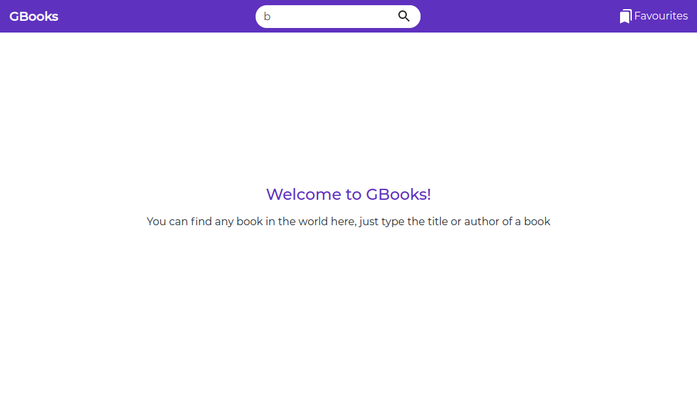

# GBooks

Gbooks is an online platform that consumes books from the Google Books Api and helps you to find any existing book available in the google books store

## Project Features

- View latest books
- Search for a book
- Bookmark or favour a book
- View single books details

## Project Perequisites

* Make sure you have Node.js installed globally on your local computer

#### Run the project locally

* Clone the project: git clone the repo
* Run npm install to download necessary packages.
* Run npm run start to start server.

## Frameworks & Libraries

* React.js
* Bootstrap
* Redux

## Dependencies/Package Manager

* fontawesome-free: npm install --save @fortawesome/fontawesome-free.
* bootstrap & react-bootstrap: npm install react-bootstrap bootstrap.
* jquery: npm install jquery --save.

## Screenshot

## Deployment

- Netlify: You can find this app deployed [here](https://gbooks-app.netlify.app/).

## Author

* Vainqueur BIHAME
